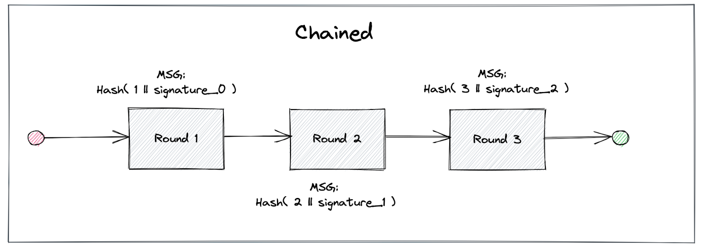
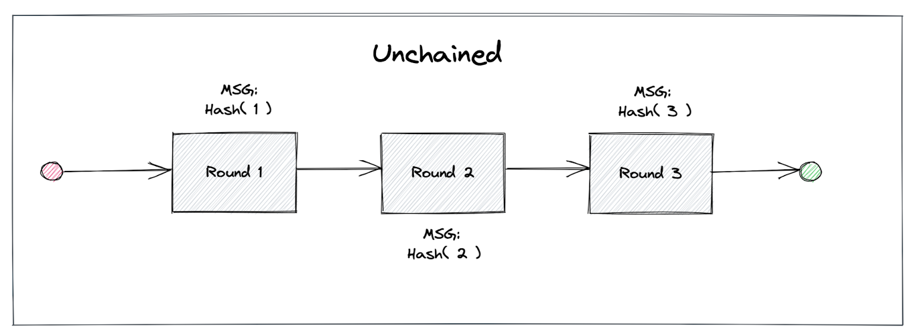

The drand team has been hard at work the last couple of months to develop and integrate new and extremely valuable features into the drand codebase! We have worked together with [Zondax](https://zondax.ch/), a research and software development company, and we are extremely excited to announce the completion of a very important project for the future of drand. The project focused on two important features that have the potential to unlock new capabilities for the drand randomness service, enable new application scenarios and make drand able to support many more applications and platforms.

In summary, the new features include:

- **Unchained Randomness**: Each randomness beacon in drand has so far been linked to the previous one, forming a chain of beacons. With this update, each beacon is now independent of (all) the previous one(s).
- **Multi-protocol Support**: Drand is now able to support multiple protocols running on the same physical node and the same binary. In other words, a node can now participate in multiple drand networks, each of which having different characteristics. These characteristics can be different frequency of emitting randomness, different thresholds, different participants or having randomness in chained or unchained mode.

We have compiled a comprehensive list of 26 Q&A in this [FAQ document](https://docs.google.com/document/d/16QJG3Z-Kr0mN6snQz8cm0NnMXpYBpelKyvCf2oo1Zgc/edit?usp=sharing). Below we provide a base summary of the new features and we encourage you to refer to the document for further details.

## Unchained Randomness & Timed Encryption

**What is this?**

According to the original drand design and implementation, every new beacon is linked to the previous one, i.e., simplistically, every new beacon includes a link to the previous beacon, used to derive the new randomness. This creates a chain of randomness beacons from the current one to the genesis beacon, when the drand network was launched. With this upgrade, we provide the option of each beacon becoming independent of the previous one, or, in other words, randomness can be “unchained”. A new drand network can still run in “chained” mode, although we recommend using the “unchained” randomness version.





**What does it enable?**

Although chained randomness provides some nice properties, having each beacon independent of the previous one presents a lot of potential for some applications: drand consumers can now enable timelock encryption in their applications, which means that they can securely encrypt a message for a specific round in the future, which can then be decrypted by anyone with the corresponding randomness. This is a very important feature which can mitigate front-running attacks in Decentralized Exchanges, and oracle platforms, as well as enabling sealed bid auctions.

**How does it work?**

Both randomness generation and consumption procedures remain the same as previously. All members of a drand network, e.g., the LoE, need to contribute their part in order for Threshold Cryptography to work. As with the Multi-Frequency support feature, no security property of the protocol is compromised.

We will deliver this API in the coming months but we provide a sneak peek at how it can look like:

First, a client encrypts a message towards a round in the future.

```plaintext
ciphertext := client.EncryptToRound(msg, round)
```

Then, once the associated randomness is created, _anybody_ can decrypt the message:

```plaintext
// get the randomness associated with the round

random := client.Randomness(round)

message := client.Decrypt(ciphertext,random)
```

With this feature, drand has the potential to solve problems that remain unsolved in the Web3.0 space, such as front-running attacks, and puts drand ahead of the competition!

## Multi-Frequency & Multi-Protocol Support

**What is this?**

Drand is producing randomness every 30 seconds, by default, and this is how it has been programmed to operate ever since the network’s launch in August 2020 and up to the present day. However, several applications operate at higher frequencies (and quite likely some others at lower frequencies). We have heard the requests from our ecosystem of users and have worked hard to refactor the codebase and make drand capable of using different randomness schemes and/or frequencies.

**What does it enable?**

Multi-protocol support enables a single set of participants to generate multiple randomness beacons of different kinds and at different frequencies. For example, you could think of the LoE-operated network generating randomness at 3s as well as generating post quantum randomness every minute.

The full details of how the refactored protocol works will be made available in our documentation (once the features land in production), but, roughly, it works as follows.

In the next mainnet upgrade, LoE partners will start running a new protocol to generate _unchained_ randomness at a higher frequency. The current protocol (chained randomness every 30s) will stay in place for the short term. The new base frequency is still to be determined, but let’s assume it is set to 3 seconds. Applications will now be able to consume randomness at any interval that is a multiple of the base frequency. So, for instance, Filecoin, which needs to consume randomness every 30 seconds, will be picking a beacon every 10th randomness generation event (once it starts following the new network). The case would be similar for an application that needs to consume randomness every, say, 6 seconds: the application would pick every other beacon generated by drand.

It is worth noting that all of the properties already natively integrated in drand, that is, verifiability, unpredictability and non-biasability, are kept intact with no compromise being made on the security properties of drand.

**How does it work?**

With the updated setup different frequencies (realized as routines) are generated and live within the same process as separate protocols, although each protocol is completely isolated from each other. Applications that wish to consume randomness at some particular frequency can form a separate network. Nodes that join each network participate in randomness generation and propagation between them and make use of the corresponding protocol.


More generally, each new frequency runs as a separate protocol. The new protocol can also choose between chained and unchained randomness. So, for instance, if we assume that the main drand network (the one operated by the LoE) runs at some specific frequency in unchained randomness mode, one can set up a new network with a different frequency and chained randomness.

It has to be highlighted that not all members of a drand network, e.g., the League of Entropy (LoE), have to participate in all frequency networks, but instead, networks can form with a subset of nodes.

This is another hugely valuable addition to drand’s features that make the service suitable for a large variety of applications and will expand drand’s customer base.

The updates have not yet been integrated into a release yet, but they’re both expected to land in the coming quarter. We hope that you’re as excited about these features as we are and we will be more than happy to discuss the needs of your particular application in order to take advantage of them. Feel free to reach out to us at:[leagueofentropy@googlegroups.com](mailto:leagueofentropy@googlegroups.com), or through drand’s website:<https://drand.love/partner-with-us/>. You can always follow developments in the public github repository:<https://github.com/drand/drand>.

